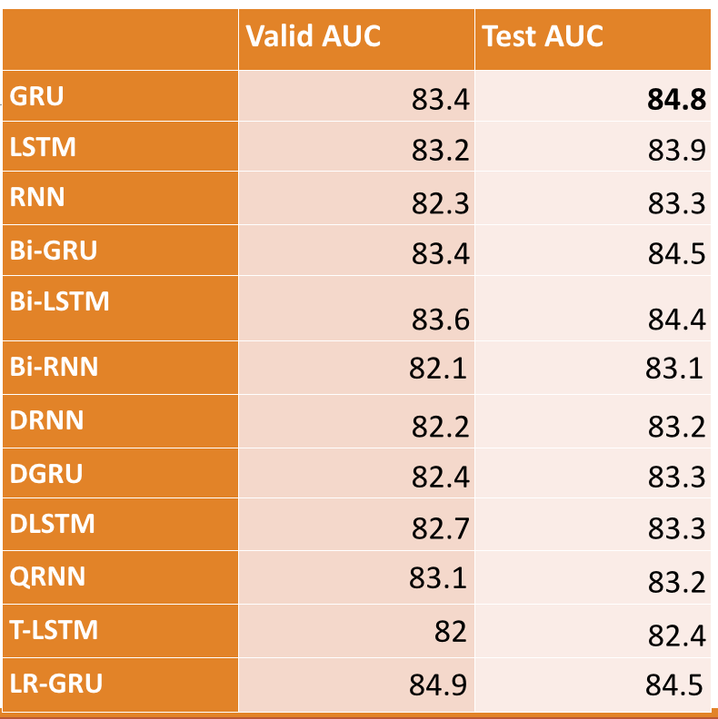
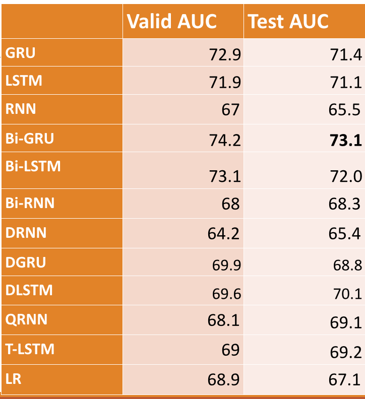
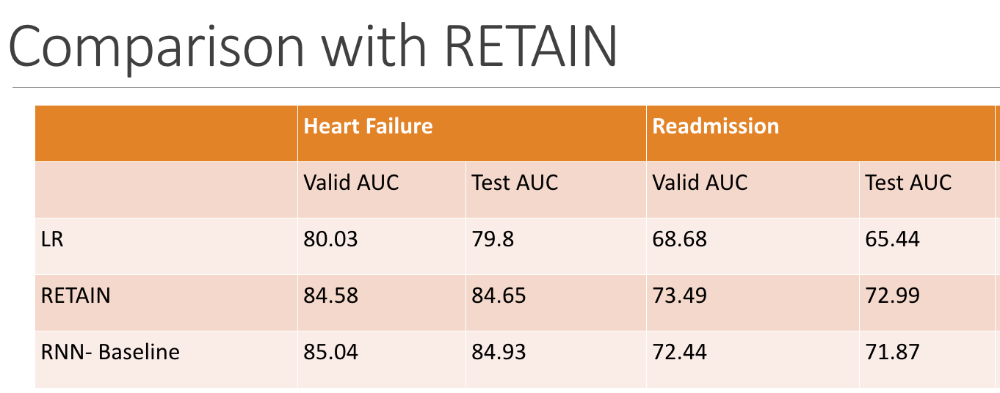

# Pytorch_ehr
***************** 
* Predictive analytics of heart failture onset & readmission risk on EHR cerner data using Pytorch library;
* Models built: Vanilla RNN, RNN with GRU, RNN with LSTM, Bidirectional RNN, Dialated RNN, QRNN, T-LSTM, GRU-Logistic Regression, plain LR, LR with embedding, Random Forest;
* ehr_pytorch: main folder with modularized components for all models, data loading and processing, and training, validation and test of models, main file for parsing arguments, and a EHRDataloader;
* 1. EHRDataloader: a separate function to allow for utilizing pytorch dataloader child object to create preprocessed data batch for testing our models;
* 2. Bayesian Optimization implemented for hyperparameters search for models, both locally using open source BayesianOptimization package and additionally using SigOpt software; 
* Experiments: folder with visualizations files (jupyter notebooks), larger datasets with separate tests for longer and shorter visits etc.;
* Data used: Cerner, with 15815 unique medical codes. Full cohort with >1,000,000 records.
* Sample results:
* 1. 
* 2. 
* 3. 
* The [paper]() upon which this repo was built. (include paper link)

## Prerequisites

* Pytorch library, <http://pytorch.org/> 
* Bayesian Optimization, <https://github.com/fmfn/BayesianOptimization>
* Optional: SigOpt software, <https://sigopt.com/> 

## Tests

* To run our models, use:
----terminal command to run the models

* To try our dataloader, use:
----sample data provided and dataloader file
(modify to details later)

## Authors

See the list of [contributors]( https://github.com/ZhiGroup/pytorch_ehr/graphs/contributors)

## Acknowledgements
Hat-tip to:
* [DRNN github](https://github.com/zalandoresearch/pt-dilate-rnn)
* [QRNN github](https://github.com/salesforce/pytorch-qrnn)
* [T-LSTM paper](http://biometrics.cse.msu.edu/Publications/MachineLearning/Baytasetal_PatientSubtypingViaTimeAwareLSTMNetworks.pdf)

